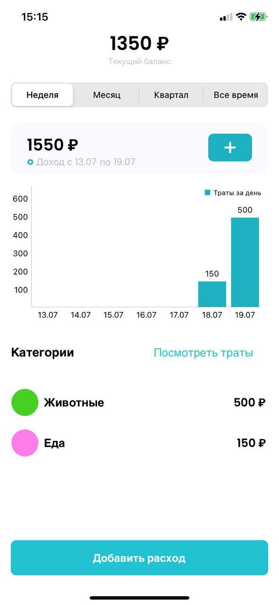
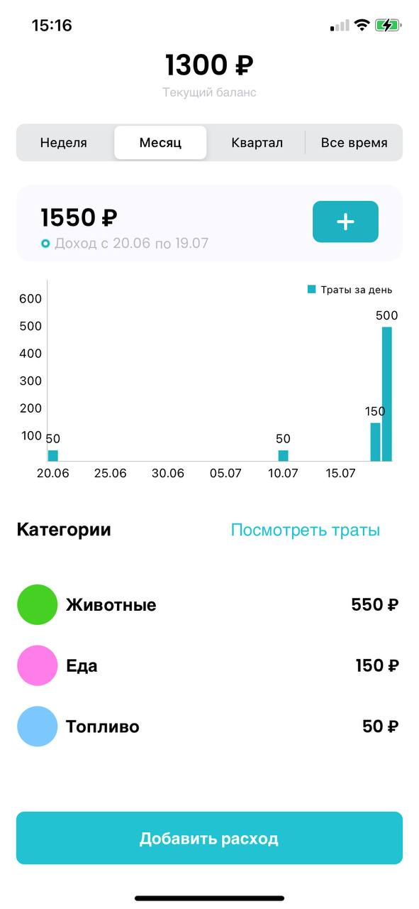
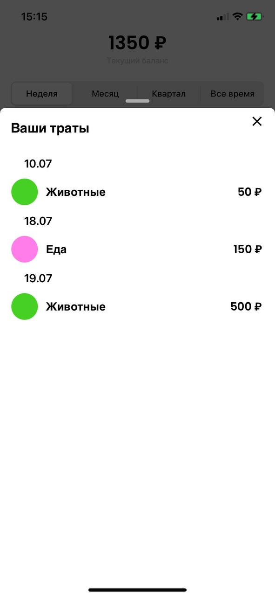
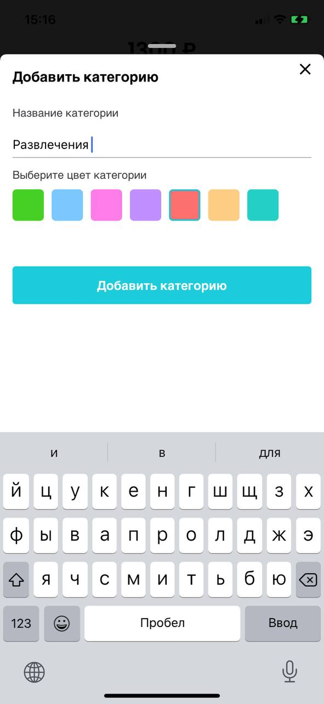
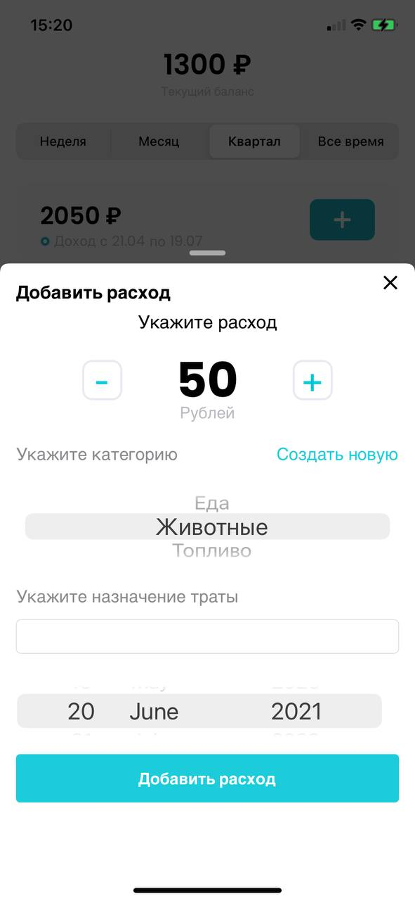

# FinanceTrack

Простой трекер расходов и доходов. Архитектура MVVM, попытка реализовать Clean Architecture.

# Основной функционал
- создание категорий трат
- добавление доходов
- добавление расходов
- отображение графика трат для недели/месяца/квартала/всего времени
- отображение списка трат

# Технологии, библиотеки
- Storyboard
- RealmSwift
- [Charts](https://github.com/danielgindi/Charts)
- [DropDown](https://github.com/AssistoLab/DropDown)
- [PanModal](https://github.com/slackhq/PanModal)

# Интерфейс
Все траты, неделя | Все траты, месяц | Список трат | Новая категория траты | Добавить трату 
--- | --- | --- |--- |--- 
 |  |  |  | 
